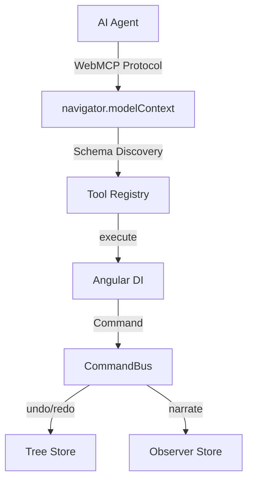

# Angular WebMCP Studio

<p align="center">
  
  
  
  
</p>

<p align="center">
  <a href="https://webmcp-studio-buur.vercel.app/" target="_blank">
    
  </a>
</p>

<p align="center">
  
</p>

## ⚠️ Estado experimental

WebMCP es un estándar W3C en desarrollo. Este proyecto usa la implementación experimental de Angular v22.

- **Agente nativo**: Edge 147+ / Chrome 149+ (`chrome://flags#webmcp`)
- **Fallback**: simulador integrado que cubre todos los flujos sin agente nativo
- **APIs sujetas a cambios** entre versiones menores de Angular

IDE visual para agentes de IA sobre **WebMCP** (Angular v22). La IA crea, lee y modifica componentes en tiempo real; cada mutación del editor es una **tool WebMCP** o un **Command** con undo/redo.

## Por qué WebMCP

La mayoría de los agentes que “controlan” una web app lo hacen **desde afuera**: leen el DOM, adivinan la UI y hacen clics en pantalla. WebMCP invierte eso: la app **expone tools tipadas** que el agente descubre e invoca como una API.

| Sin WebMCP | Con WebMCP Studio |
|------------|-------------------|
| La IA lee el DOM con OCR o heurísticas | La IA ejecuta `create_component` directamente |
| Clics en coordenadas X,Y frágiles | Llamadas estructuradas con validación de schema |
| No entiende el estado interno | Acceso al árbol real vía `read_tree` |
| Requiere prompts complejos | Descubrimiento automático de tools |
| Sin undo/redo del agente | Commands con narración y reversión |

### Comparativa con otras herramientas

No es otro generador de UI: es un **IDE donde un agente edita la estructura Angular en vivo**, con undo/redo por nodo y preview inmediato.

| Herramienta | Cómo funciona | Limitación | WebMCP Studio |
|-------------|---------------|------------|---------------|
| **Playwright + AI** (Microsoft) | La IA ve screenshots y hace clics | Lento, frágil, no entiende estado | Tools tipadas, &lt;50 ms por acción |
| **Browser Use** | Controla el navegador vía CDP | Requiere infraestructura; no es nativo | Corre en el browser, sin backend |
| **Vercel v0** | Genera UI desde prompt | No editable iterativamente por agente | El agente modifica la estructura en vivo |
| **Lovable.dev** | Genera código desde chat | Re-genera todo; no hay edición granular | Undo/redo por nodo, preview inmediato |

## 🧪 Prompt para agentes de IA

Así podría pedirle un usuario (o un system prompt) a un agente WebMCP nativo que diseñe en el Studio. El agente **descubre las tools** en el panel derecho; no hace falta memorizar schemas — pero un prompt claro acelera el resultado.

```text
Eres un agente de diseño UI. Tienes acceso a Angular WebMCP Studio.
El usuario quiere una landing page para un SaaS de analytics.

1. Crea un proyecto llamado "AnalyticsLanding"
2. Agrega un navbar con brand "DataViz" y links ["Features", "Pricing", "Contact"]
3. Crea un hero container con título "Visualiza tus datos" y subtítulo "Dashboards en tiempo real para equipos de datos"
4. Agrega 3 cards con features: "Real-time", "AI Insights", "Collaboration"
5. Genera el código Angular y muéstrame el preview

Tools disponibles: create_component, update_component, move_component,
read_tree, new_component_via_form, update_component_via_form, export_project_code
```

**Cómo lo ejecuta el agente en la práctica**

| Paso del prompt | Tool / acción en el Studio |
|-----------------|----------------------------|
| Proyecto `AnalyticsLanding` | Renombrar en topbar o nuevo proyecto en `/project/…` |
| Navbar, hero, cards | `create_component` (`container`, `card`, `text`, `button`) + `update_component` / `update_component_via_form` para labels y textos |
| Revisar estructura | `read_tree` antes de editar; `move_component` para ordenar |
| Preview | Canvas en modo **Preview** (o el agente inspecciona tras cada `create_component`) |
| Código Angular | `export_project_code` con `download: true` → ZIP listo para `npm start` |

> Los tipos disponibles son `container`, `card`, `button`, `text` e `input`. Un “navbar” o “hero” se modelan anidando contenedores y nodos de texto — el agente no scrapea el DOM.

## Características

### Editor visual
- **4 paneles**: árbol de componentes, canvas (Estructura / Preview), panel de herramientas y consola del agente.
- **Árbol**: paleta para crear nodos, drag & drop (CDK) para reordenar/reparentar, navegación por teclado (↑↓←→, Home/End, Supr).
- **Canvas Preview**: render dinámico con `NgComponentOutlet` (botón, texto, input, contenedores).
- **Inspector de propiedades**: Signal Form para `label` y props por tipo (`variant`, `text`, `placeholder`).
- **Undo/redo** global (toolbar, consola y atajos Ctrl/Cmd+Z, Ctrl/Cmd+Shift+Z o Ctrl+Y). No se activa en campos editables ni `contenteditable`.

### WebMCP
- Tools de edición: `create_component`, `update_component`, `delete_component`, `move_component`, `read_tree`, `list_component_types`, `undo`, `redo`, **`export_project_code`**.
- **Signal Forms como tools**: `new_component_via_form`, `update_component_via_form` (`experimentalWebMcpTool`).
- Tools de app: `greet`, `ping_studio`. En `/docs`: `search_docs`, `list_sections`.
- **Auto-cleanup por ruta**: las tools del editor viven en `project/:id` y se desregistran al navegar (`withExperimentalAutoCleanupInjectors`).
- **Simulador de agente** en el canvas para probar tools sin agente nativo del navegador.
- Respuestas con flag **`isError`** para que el agente distinga éxito de error.

### Modo Observador
- Timeline en la consola con pasos narrados (qué, por qué, nodos afectados, origen 🤖/🙂).
- Acciones **manuales y del agente** (vía `CommandBus` y tools).
- Input `rationale` en las tools de edición; toggle para activar/desactivar la narración.

### Proyectos y persistencia
- **IndexedDB** sin dependencias extra (`PersistenceService`).
- Multiproyecto por ruta `project/:id`; autosave debounced; undo no cruza proyectos.
- Topbar: crear, **renombrar**, **borrar**, exportar JSON, **exportar Angular ZIP** (`npm install && npm start`).
- Import con **validación** del árbol y **confirmación** antes de sobrescribir.
- Entrada en `/`: último proyecto usado, o **`alpha`** por defecto (`/project/alpha`).
- Errores de persistencia visibles en la barra de estado (`role="status"`).

### Accesibilidad y layout
- ARIA en topbar, árbol, tabs de la consola y preview widgets.
- Layout **responsive** en pantallas &lt; 1100px (paneles apilados).

## Arranque

```bash
npm install
npm start        # http://localhost:4200
npm run build
```

Al abrir la app, `/` redirige al último proyecto que usaste o a **`/project/alpha`** por defecto (se crea si no existe).

## Probarlo

1. En el árbol, selecciona un nodo y usa la paleta (Contenedor, Card, Botón…) para crear hijos.
2. Arrastra por ⠿ para reordenar o reparentar; usa las flechas del teclado con el foco en el árbol.
3. Edita propiedades en el inspector del canvas y aplica con un único Command `updateNode`.
4. Prueba el **simulador de agente** o invoca tools desde un agente WebMCP (Edge 147+ / Chrome 149).
5. Revisa la pestaña **Observador** en la consola: cada paso queda narrado.
6. Exporta el proyecto como **Angular ZIP** desde el topbar o con la tool `export_project_code`.

## Cómo Funciona Internamente

La IA no manipula el DOM directamente: cada acción atraviesa **WebMCP** → **Angular DI** → **CommandBus** → **stores** en signals. Las tools se registran por ruta y se limpian solas al navegar.

```
┌─────────────────┐     ┌─────────────────┐     ┌─────────────────┐
│   AI Agent      │────▶│  WebMCP Bridge  │────▶│  Angular DI     │
│  (Browser AI)   │◄────│  (navigator.    │◄────│  (CommandBus)   │
│                 │     │   modelContext) │     │                 │
└─────────────────┘     └─────────────────┘     └─────────────────┘
                                │
                                ▼
                        ┌─────────────────┐
                        │  Tool Registry  │
                        │  (Auto-cleanup  │
                        │   per route)    │
                        └─────────────────┘
```

Flujo detallado (renderizado en GitHub con [Mermaid](https://mermaid.js.org)):



| Capa | Rol |
|------|-----|
| **AI Agent** | Invoca tools vía `navigator.modelContext` (o simulador en el canvas). |
| **WebMCP Bridge** | `provideExperimentalWebMcpTools` + polyfill; expone schemas y `execute()`. |
| **Tool Registry** | Refleja tools en el panel; auto-cleanup al salir de `project/:id` o entrar en `docs`. |
| **CommandBus** | Despacha Commands, undo/redo con snapshots y narración de acciones manuales. |
| **Tree Store** | Árbol normalizado en signals; fuente de verdad del editor y del export Angular. |

## Estructura

```
src/app/
├── core/
│   ├── commands/      # Command, tree-commands, CommandBus (undo/redo + narración manual)
│   ├── persistence/   # IndexedDB (PersistenceService)
│   ├── export/        # generador de proyecto Angular + ZIP
│   ├── state/         # stores (árbol, proyectos, observador, tools, log)
│   └── webmcp/        # tools, serialización, validación, tipos WebMCP
├── panels/
│   ├── component-tree/
│   ├── canvas/        # estructura, preview, Signal Forms
│   ├── agent-console/
│   ├── tool-panel/
│   ├── docs/
│   └── project-entry.ts   # redirección inicial
├── shell/             # layout 4 paneles + topbar
└── app.routes.ts      # project/:id, docs, /
```

## Testing

```bash
npm test              # unit (Vitest) — 44 tests
npm run test:watch    # Vitest en modo watch
npm run test:e2e      # e2e (Playwright)
npm run demo:hero     # GIF hero del README (~15 s)
npm run demo:gif      # webm hero → docs/demo.gif (ffmpeg + gifsicle)
npm run demo:optimize # recomprime docs/demo.gif si ya existe
npm run demo:readme   # hero + gif optimizado en un paso
npm run demo:video    # recorrido completo (DEMO.md, escenas 0–8)
```

El GIF del README pesa **~1 MB** (960×540, 8 fps, paleta 96 colores + `gifsicle -O3 --lossy=80`). Sin optimizar suele superar 2 MB.

Cobertura unitaria: store del árbol, Commands, CommandBus, tools de edición, validación/import, observador, clonado del árbol y persistencia del último proyecto.

E2E (`e2e/`): crear/deshacer, narración del agente, cambio de tools editor↔docs, persistencia entre recargas.

CI en `.github/workflows/ci.yml` (test + build en push/PR).

Guion de demo en [`DEMO.md`](./DEMO.md).

## Deploy en Vercel

SPA estática: no requiere backend ni variables de entorno. La config vive en [`vercel.json`](./vercel.json).

| Setting | Valor |
|---------|-------|
| Build Command | `npm run build` |
| Output Directory | `dist/webmcp-studio/browser` |
| Install Command | `npm ci` |
| Node.js | 22 (`.nvmrc` + `engines` en `package.json`) |

### Pasos

1. Subir el repo a GitHub.
2. En [vercel.com](https://vercel.com) → **Add New Project** → importá el repositorio.
3. Vercel detecta `vercel.json` automáticamente; confirmá y hacé **Deploy**.
4. Abrí **[webmcp-studio-buur.vercel.app](https://webmcp-studio-buur.vercel.app/)** → redirige a `/project/alpha` (o al último proyecto usado).

Los **rewrites** envían rutas como `/project/alpha` y `/docs` a `index.html` para que el router de Angular funcione al recargar o compartir links.

### Notas de producción

- **Persistencia**: IndexedDB es local al navegador y dominio; no sincroniza entre dispositivos.
- **WebMCP**: el agente corre en el cliente (Edge 147+ / Chrome 149); Vercel solo sirve el frontend.
- **Preview deployments**: cada PR puede tener su URL de preview si conectás el repo.

## Stack

- Angular v22 **standalone + zoneless**, TypeScript 6.0, Signals y Signal Forms.
- Polyfill `@mcp-b/webmcp-polyfill` cuando `navigator.modelContext` no está disponible.
- El árbol se clona con `cloneTreeState` (sin `JSON.stringify`) para snapshots de undo/redo.
