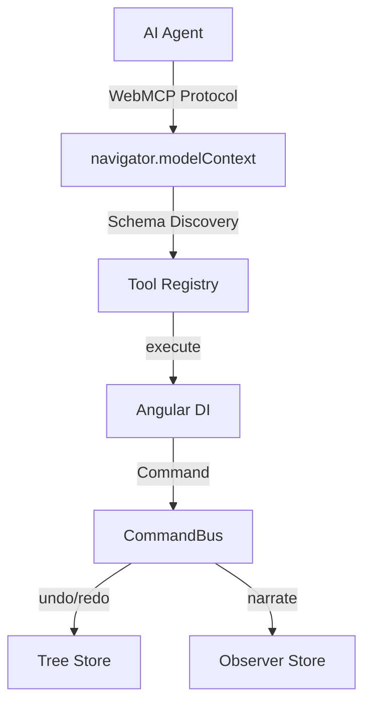

# Angular WebMCP Studio

<p align="center">
  <a href="https://github.com/marius1973/webmcp-studio/actions/workflows/ci.yml">
    
  </a>
  
  
  
  
</p>

<p align="center">
  <a href="https://webmcp-studio-buur.vercel.app/" target="_blank">
    
  </a>
</p>

<p align="center">
  
</p>

Un **IDE en el navegador** donde los agentes de IA editan estructura Angular en vivo — no generan código de una vez, sino que mutan, deshacen y observan paso a paso.

## Por qué WebMCP

La mayoría de los agentes que “controlan” una web app lo hacen **desde afuera**: leen el DOM, adivinan la UI y hacen clics en pantalla. WebMCP invierte eso: la app **expone tools tipadas** que el agente descubre e invoca como una API.

| Sin WebMCP | Con WebMCP Studio |
|------------|-------------------|
| La IA lee el DOM con OCR o heurísticas | La IA ejecuta `create_component` directamente |
| Clics en coordenadas X,Y frágiles | Llamadas estructuradas con validación de schema |
| No entiende el estado interno | Acceso al árbol real vía `read_tree` |
| Requiere prompts complejos | Descubrimiento automático de tools |
| Sin undo/redo del agente | Commands con narración y reversión |

### Comparativa con otros enfoques

*Comparación conceptual de enfoques, no de rendimiento ni paridad de producto.* Herramientas como v0 o Lovable generan apps de cero; este studio **itera sobre estructura existente** con undo/redo por nodo.

| Enfoque | Cómo opera | Tensión típica | WebMCP Studio |
|---------|------------|----------------|---------------|
| **Automatización visual** (p. ej. Playwright + IA) | Screenshots y clics en pantalla | Frágil ante cambios de UI; poco estado interno | Llamadas directas a tools, sin screenshots ni OCR |
| **Control remoto del browser** (p. ej. Browser Use) | CDP desde fuera del tab | Infra extra; no es API nativa de la app | Corre en el browser, sin backend |
| **Generadores one-shot** (p. ej. v0, Lovable) | Prompt → app o código nuevo | Poca edición granular por el agente | El agente muta el árbol paso a paso, con preview |
| **Este studio** | Tools WebMCP sobre Commands | Experimental (ver abajo) | Undo/redo, Observador y export Angular |

## ⚠️ Estado experimental

WebMCP es un estándar W3C en desarrollo. Este proyecto usa la implementación experimental de Angular v22.

- **Demo en vivo** ([webmcp-studio-buur.vercel.app](https://webmcp-studio-buur.vercel.app/)): funciona en **cualquier navegador** con el **simulador** y el polyfill — no hace falta agente nativo.
- **Agente nativo del navegador**: **Edge 147+** (integrado, `navigator.modelContext`).
- **Chrome 149+**: [Origin Trial](https://developer.chrome.com/docs/ai/webmcp) para visitantes en producción (token por origen); en local, flag [`chrome://flags/#enable-webmcp-testing`](https://developer.chrome.com/docs/ai/webmcp#local-webmcp) (no `chrome://flags#webmcp`).
- **Fallback**: simulador integrado + `@mcp-b/webmcp-polyfill` cubren el mismo contrato de tools.
- **APIs sujetas a cambios** entre versiones menores de Angular.

<details>
<summary>🧪 Prompt para agentes de IA</summary>

Ejemplo de system prompt **alineado con la demo**: el Preview muestra bloques etiquetados (`container`, `card`, `text`, `button`) — un **esqueleto estructural**, no una landing pulida con navbar ni links.

```text
Eres un agente en Angular WebMCP Studio.
Tipos disponibles: container, card, button, text, input, link, divider, image.
Preview wireframe con layout (direction, gap, align, textSize) — no es diseño final.

Construye un esqueleto de landing para analytics:

1. read_tree — inspecciona root antes de editar
2. run_playbook(landing-analytics) — o paso a paso con create_component
3. suggest_next — revisa qué falta (CTA, cards vacías…)
4. Preview — confirma estructura anidada
5. export_project_code con download: true → ZIP Angular (secciones + rutas)

Tools: create_component, update_component, move_component, read_tree,
run_playbook, apply_patch, explain_selection, suggest_next, export_schema,
export_project_code, new_component_via_form, update_component_via_form
```

**Qué verás en el demo** (coincide con el prompt):

| Pedido en el prompt | En el árbol / Preview |
|---------------------|------------------------|
| `container` "Hero" + textos + botón | Marco con etiqueta **Hero**, textos y botón renderizados como widgets simples |
| 3 `card` con `text` hijo | Tres tarjetas con borde sólido y un bloque de texto cada una |
| Preview | Bloques anidados con labels — **wireframe**, no SaaS terminado |
| `export_project_code` | ZIP Angular con secciones, rutas lazy y `npm start` listo |

**Cómo lo ejecuta el agente**

| Paso | Tool / acción |
|------|----------------|
| Inspeccionar | `read_tree` |
| Hero y cards | `create_component` + `update_component` / `update_component_via_form` para `label`, `text`, `variant` |
| Orden | `move_component` si hace falta reordenar |
| Ver resultado | Modo **Preview** en el canvas |
| Código | `export_project_code` con `download: true` |

> Renombrar el proyecto a "AnalyticsLanding" es opcional (menú **Proyecto → Renombrar**). El valor del demo es el **flujo agente → tools → árbol → undo → export**, no el pixel-perfect.

</details>

## Características

Cada mutación — manual o del agente — es una **tool WebMCP** o un **Command** con undo/redo, narración en el Observador y export a Angular.

### Editor visual
- **4 paneles**: árbol de componentes, canvas (Preview / Estructura), panel de herramientas y consola del agente.
- **Árbol**: menú **＋ Añadir** (8 kinds), drag & drop (CDK), navegación por teclado (↑↓←→, Home/End, Supr).
- **Canvas**: el **stage** (Preview / Estructura) ocupa el centro; inspector y simulador en secciones colapsables.
- **Preview**: `NgComponentOutlet` + layout flex (`direction`, `gap`, `align`, `textSize`) — wireframe estructural.
- **Inspector**: Signal Form por tipo; visible al seleccionar un nodo (no root).
- **Playbooks** en el simulador (colapsable): *Landing analytics*, *Formulario contacto* (un solo undo).
- **Undo/redo** en la toolbar del canvas y atajos Ctrl/Cmd+Z, Ctrl/Cmd+Shift+Z o Ctrl+Y.

### WebMCP
- Tools de edición: `create_component`, `update_component`, `delete_component`, `move_component`, `read_tree`, `list_component_types`, `undo`, `redo`, `export_project_code`, **`run_playbook`**, **`apply_patch`**, **`explain_selection`**, **`suggest_next`**, **`export_schema`**, **`list_playbooks`**.
- Tools declarativas (nodo seleccionado): `update_selected_component`, `delete_selected_component`.
- **Signal Forms como tools**: `new_component_via_form`, `update_component_via_form`.
- Tools de app: `greet`, `ping_studio`. En **`/docs`**: `search_docs`, `list_sections` (auto-cleanup de tools de edición).
- **Panel de herramientas**: sección **Destacadas (demo)** + grupos (Edición, Asesor, Forms, App).
- **Auto-cleanup por ruta** (`withExperimentalAutoCleanupInjectors`).
- **Simulador de agente** en el canvas (sección colapsable); respuestas con **`isError`**.
- **Consentimiento** antes de `delete_component` / `apply_patch` (modal).

### Modo Observador
- Timeline con pasos narrados (qué, por qué, nodos afectados, origen 🤖/🙂).
- **Replay**: clic en un paso → resalta nodos en árbol y preview.
- Acciones manuales y del agente; toggle para activar/desactivar narración.

### Proyectos y persistencia
- **IndexedDB** (`PersistenceService`); multiproyecto `project/:id`; autosave debounced.
- Topbar: selector de proyecto, menú **Proyecto** (nuevo con plantillas, renombrar, borrar), menú **Exportar** (JSON, Angular ZIP, import), **🔗 Compartir** (`?share=`).
- Plantillas al crear: blank, landing-saas, login, dashboard-shell.
- Import con validación y confirmación; entrada `/` → último proyecto o `alpha`.
- **Telemetría opt-in** (checkbox Stats): eventos locales, sin red ni PII.

### Docs (`/docs`)
- Ruta separada que demuestra **auto-cleanup**: desaparecen tools de edición y aparecen `search_docs` / `list_sections`.
- Ayuda en app sobre el cambio de tools por ruta; corpus consultable en evolución.

### Accesibilidad y layout
- ARIA en topbar, árbol, tabs de la consola y preview widgets.
- Layout **responsive** en pantallas &lt; 1100px (paneles apilados).

## Arranque

```bash
npm install
npm start        # http://localhost:4200
npm run build
```

Al abrir la app, `/` redirige al último proyecto utilizado o a **`/project/alpha`** por defecto (se crea si no existe).

## Probarlo (30 segundos)

1. Abre el **[demo](https://webmcp-studio-buur.vercel.app/)** o `npm start` → `http://localhost:4200`.
2. Expande **Simular agente y playbooks** → playbook **Landing analytics** → pestaña **Observador**.

Para explorar más:

1. Menú **＋ Añadir** en el árbol; drag & drop por ⠿; inspector al seleccionar un nodo.
2. `suggest_next` / `explain_selection` desde el simulador (sección colapsable).
3. Clic en un paso del **Observador** → resalta nodos afectados.
4. **🔗 Compartir** copia URL con el árbol (`?share=`).
5. Menú **Exportar → Angular ZIP** o tool `export_project_code`.
6. Enlace **Docs** → observa el cambio de tools en el panel derecho.
7. Checkbox **Stats** (telemetría local opt-in).

<details>
<summary>Cómo funciona internamente</summary>

La IA no manipula el DOM directamente: cada acción atraviesa **WebMCP** → **Angular DI** → **CommandBus** → **stores** en signals. Las tools se registran por ruta y se limpian solas al navegar.



| Capa | Rol |
|------|-----|
| **AI Agent** | Invoca tools vía `navigator.modelContext` (o simulador en el canvas). |
| **WebMCP Bridge** | `provideExperimentalWebMcpTools` + polyfill; expone schemas y `execute()`. |
| **Tool Registry** | Refleja tools en el panel; auto-cleanup al salir de `project/:id` o entrar en `docs`. |
| **CommandBus** | Despacha Commands, undo/redo con snapshots y narración de acciones manuales. |
| **Tree Store** | Árbol normalizado en signals; fuente de verdad del editor y del export Angular. |

</details>

## Estructura

```
src/app/
├── core/
│   ├── commands/      # CommandBus (undo/redo, batch, narración)
│   ├── playbooks/     # playbooks + executor (@last/@parent)
│   ├── export/        # Angular ZIP, tree-schema, secciones
│   ├── bridge/        # puente postMessage / WS (dev)
│   ├── persistence/   # IndexedDB
│   ├── state/         # stores (árbol, proyectos, observador, consent, telemetry)
│   └── webmcp/        # tools, advisor, validación
├── panels/            # árbol, canvas, consola, docs
├── shell/             # layout 4 paneles + topbar
└── app.routes.ts
```

Documentación extra: [`docs/ORIGIN_TRIAL.md`](./docs/ORIGIN_TRIAL.md) · [`docs/MCP_BRIDGE.md`](./docs/MCP_BRIDGE.md) · [`docs/BUNDLE.md`](./docs/BUNDLE.md) · [`docs/LINKEDIN_ARTICLE.md`](./docs/LINKEDIN_ARTICLE.md)

## Testing

```bash
npm test              # unit (Vitest) — 66 tests
npm run test:watch
npm run test:e2e      # e2e (Playwright) — también en CI
npm run benchmark     # WebMCP vs DOM simulado (honesto)
npm run bridge        # hub WebSocket para integración externa (dev)
npm run demo:hero     # GIF hero del README (~15 s)
npm run demo:gif
npm run demo:readme   # hero + gif optimizado
npm run demo:video    # recorrido completo (DEMO.md)
```

CI en [`.github/workflows/ci.yml`](./.github/workflows/ci.yml): `npm test` + `npm run build` + **e2e** en push a `master`.

Guion de demo en [`DEMO.md`](./DEMO.md).

## Deploy (solo si quieres alojar tu propia instancia)

¿Solo quieres probar? Usa el **[demo en vivo](https://webmcp-studio-buur.vercel.app/)** — no hace falta desplegar nada.

<details>
<summary>Click para instrucciones de Vercel</summary>

SPA estática. Config en [`vercel.json`](./vercel.json). Build: `ng build` + inyección opcional de Origin Trial ([`docs/ORIGIN_TRIAL.md`](./docs/ORIGIN_TRIAL.md)).

| Setting | Valor |
|---------|-------|
| Build Command | `npm run build` |
| Output Directory | `dist/webmcp-studio/browser` |
| Install Command | `npm ci` |
| Node.js | 22 |
| Env opcional | `WEBMCP_ORIGIN_TRIAL_TOKEN` (Chrome WebMCP nativo) |

### Pasos

1. Subir el repo a GitHub.
2. En [vercel.com](https://vercel.com) → **Add New Project** → importa el repositorio.
3. Vercel detecta `vercel.json` automáticamente; confirma y haz **Deploy**.
4. Abre tu URL (ej. **[webmcp-studio-buur.vercel.app](https://webmcp-studio-buur.vercel.app/)**) → redirige a `/project/alpha` (o al último proyecto utilizado).

Los **rewrites** envían rutas como `/project/alpha` y `/docs` a `index.html` para que el router de Angular funcione al recargar o compartir links.

### Notas de producción

- **Persistencia**: IndexedDB es local al navegador y dominio; no sincroniza entre dispositivos.
- **WebMCP**: el agente nativo corre en el cliente (Edge 147+; Chrome 149+ OT). El demo en Vercel usa simulador/polyfill — no requiere flags.
- **Preview deployments**: cada PR puede tener su URL de preview si conectas el repo.

</details>

## Stack

- Angular v22 **standalone + zoneless**, TypeScript 6.0, Signals y Signal Forms.
- Polyfill `@mcp-b/webmcp-polyfill`; JSZip en chunk lazy al exportar ZIP.
- PWA mínima (`manifest` + service worker en producción).
- `cloneTreeState` para snapshots de undo/redo.

## Por qué importa

Los agentes de IA no deberían ser "usuarios" de las apps que usamos.
Deberían ser **ciudadanos de primera clase** con APIs diseñadas para ellos.

WebMCP es ese API: no reemplaza al humano, le da a la IA un modo de operar
que es seguro, reversible y observable. Este studio es una prueba de que
Angular puede ser la plataforma donde esa visión se construye.

Si te interesa el futuro de la IA en el navegador, [discutamos](https://github.com/marius1973/webmcp-studio/discussions).
